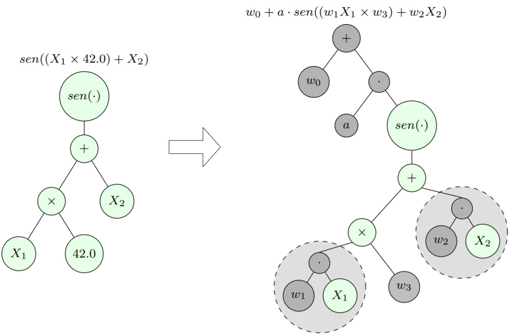

# GP-NLS-julia

Julia implementation of the GP-NLS algorithm described in the paper:

> [Kommenda, M., Burlacu, B., Kronberger, G. et al. Parameter identification for symbolic regression using nonlinear least squares. _Genet Program Evolvable_ _Mach_ 21, 471–501 (2020)](https://link.springer.com/article/10.1007/s10710-019-09371-3).

The
documentation of this package is available [here](https://galdeia.github.io/GP-NLS-julia/).

Symbolic regression is the task of finding a good mathematical expression
to describe the relationship between a set of independent variables 
$\mathbf{X} = X_1, X_2, \ldots, X_n$ with a dependent variable $Y$, normally represented as tabular data:

$$\mathcal{X} = \begin{bmatrix}
    X_{1,1} & X_{1,2} & \ldots & X_{1,n} \\ 
    X_{2,1} & X_{2,2} & \ldots & X_{2,n} \\ 
    \vdots & \vdots & \ddots & \vdots \\ 
    X_{m,1} & X_{m,2} & \ldots & X_{m,n}
    \end{bmatrix}, 
    \mathbf{Y} = \begin{bmatrix}
    Y_{1}\\ 
    Y_{2} \\ 
    \vdots \\ 
    Y_{m} 
    \end{bmatrix}.$$

In other words, suppose that you have available $m$ observations with $n$ variables, and a response variable that you supose that have a relationship $f(\mathbf{X}) = Y$, but the function $f$ is unknown: we can only see how the response changes when the input changes, but we don't know how the response is described by the variables of the problem. Symbolic regression tries to find a function $\widehat{f}$ that approximates the output of the unknown function just by learning mathematical structures from the data itself.



-----

The implementation is within folder ``./GeneticProgrammingNLS``. In ``./docs`` you can
find an automatically generated documentation for the package. In ``./experiments``
there are some scripts to evaluate the different ways of creating/optimizing
free parameters of the symbolic regression models, with results reported in
``./experiments/results`` and comparative plots in ``./experiments/plots``

## Installing:

inside the git root folder (which contains the implementation of GP-NLS for
symbolic regression) start a julia terminal and enter in the _pkg_ manager
environment by pressing ``]``. To add GP_NLS to your local packages:

```julia
dev .
```

Now you can use the "original" GP as well as the GP with non-linear least 
squares optimization by importing it:

```julia
using GP_NLS
```

The first time you import, Julia wil precompile all files, this can take a while.

## Testing:

inside ``.GP-NLS`` folder (which contains the implementation of GP-NLS for
symbolic regression) start a julia terminal and enter in the _pkg_ manager
environment by pressing ``]``.

First you need to activate the local package:

```julia
activate .
```

Then you can run the tests:

```julia
test
```

### Building the docs:

You need to have ``Documenter``. First, install it using the package manager:

```julia
import Pkg; Pkg.add("Documenter")
```

Then, inside the ``./docsource`` folder, run in the terminal:

```bash
julia make.jl
```