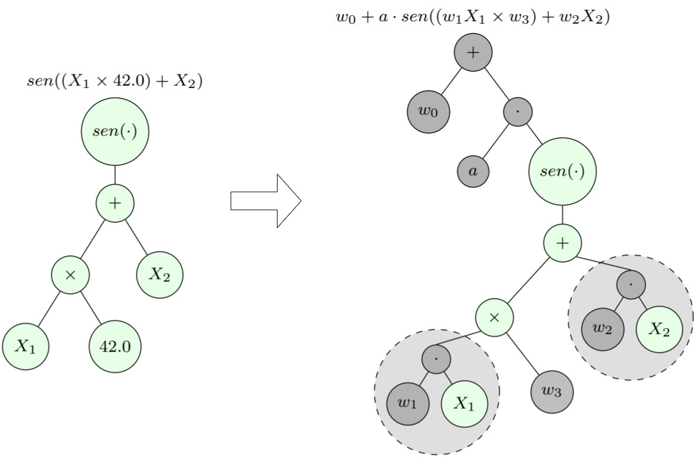

# GP_NLS in Julia Documentation

Julia implementation of the GP-NLS algorithm for symbolic regression described in the paper:

> [Kommenda, M., Burlacu, B., Kronberger, G. et al. Parameter identification for symbolic regression using nonlinear least squares. _Genet Program Evolvable_ _Mach_ 21, 471–501 (2020)](https://link.springer.com/article/10.1007/s10710-019-09371-3).

## What is Symbolic Regression?

Symbolic regression is the task of finding a good mathematical expression
to describe the relationship between a set of independent variables$\mathbf{X} = X_1, X_2, \ldots, X_n$
with a dependent variable$Y$, normally represented as tabular data:

In other words, suppose that you have available$m$ observations with$n$ variables, and a response variable that you supose that have a relationship$f(\mathbf{X}) = Y$, but the function$f$ is unknown: we can only see how the response changes when the input changes, but we don't know how the response is described by the variables of the problem. Symbolic regression tries to find a function$\widehat{f}$ that approximates the output of the unknown function just by learning mathematical structures from the data itself.

## How GP-NLS works

The idea behind the use of evolutionary algorithms is to manipulate a population of mathematical expressions computationally (represented using expression trees). A fitness function, which measures how good each expression is (this function could be, for example, the Mean Squared Error) the individuals of the population have their _fitness_ to represent how well each function describes the data. Through variation operations (which define the power of _exploration_ of the algorithm, done in the full search space, or the power of _exploration_, which performs a local search) and selective pressure (which promote the maintenance of good solutions in the population), a simulation of the evolutionary process tends to converge to good solutions present in the population. However, it is worth noting that there is no guarantee that the optimal solution will be found, although generally, the algorithm will return a good solution if possible.

The genetic programming algorithm starts with a random population of solutions, which are represented by trees, and then using a fitness function, it repeats the process of selecting the parents, performing the cross between them, applying a mutation on the child solutions, and, finally set a new generation choice between parents and children. This process is repeated until a stop criteria is met.

GP-NLS creates symbolic trees but expands them by adding an intercept, slope, and a coefficient to every variable. The new free parameters are then adjusted using the non-linear optimization method called Levenberg-Marquardt.

## Functions visible by import

The functions that are exported are listed below. 

### Types

* [`Func`](@ref)
* [`Const`](@ref)
* [`Var`](@ref)
* [`WeightedVar`](@ref)
* [`ERC`](@ref)      
  
### Default sets

* [`defaultFunctionSet`](@ref)
* [`defaultConstSet`](@ref)
* [`defaultERCSet`](@ref)     

### Auxiliary functions

* [`evaluate`](@ref)
* [`getstring`](@ref)
* [`numberofnodes`](@ref)
* [`depth`](@ref)
* [`true_numberofnodes`](@ref)
* [`true_depth`](@ref)        

### Genetic Programming algorithm

* [`GP`](@ref)
* [`fitness`](@ref)
     

## All functions

The module has some built-in auxiliary functions that its external use is not
recommended. All implementations are listed in the modules of the
library, but only some functions are exported outside the package.